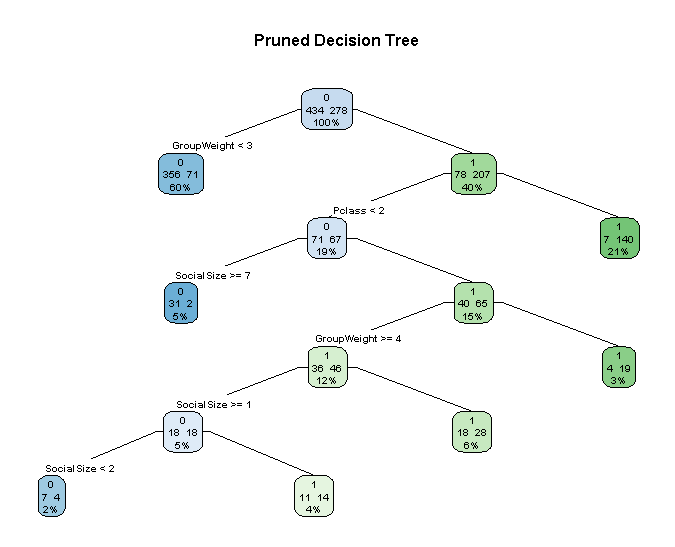

# Titanic Survival Prediction — Notes

## Dataset Overview

| Column | Info |
|--------|------|
| ID | — |
| Survived | 0 [61%], 1 [38%] |
| Pclass | 1st [24%], 2nd [20%], 3rd [55%] |
| Name | — |
| Sex | Male [65%], Female [35%] |
| Age | — |
| SibSp | (0-x) Number of Siblings/Spouses — maybe higher survival if she has a husband |
| Parch | (0-x) Number of Parents/Children — maybe female with a child higher survival |
| Ticket | There are less tickets than passengers? |
| Fare | Price |
| Cabin | (xy) |
| Embarked | C [19%], Q [8%], S [72%] |

---

## Initial Thoughts

First of all I thought this will be simple, but every step I think of I get new problems.

### Missing Data
- Age: 177 missing
- Cabin: 687 missing
- Embarked: 2 missing

### Age
Age is likely the most critical point because of the "women and children first" rule, so the only ways I see this work out is if I train a model to guess the ages themselves

> **EDIT:** The title (Mr, Mrs...) can predict the age with good accuracy.

Cutoff for getting a lifeboat was 13 years:
- Mr: 18+
- Mrs: 18+
- Miss: unknown (maybe if Parch is above 1 it means child, but likely irrelevant for results)
- Master: 13- (what about 14-18 then?)

### Cabin
Planned to sort based on time to receive danger information and depth in the ship, but first and second class were the only ones that even got the news. So because first and second are closest and got the news while third is last with no news, categorized as (1, 2, 4).

> **Note:** I checked the layout and the numbers should be adjusted based on how close to the lifeboat they are. Since only 44-48 people survived without taking a lifeboat, keeping it as is for simplicity.

### Embarked
No clear signal unless accounting for cultural differences from the locations themselves — too much work for probably not that much higher prediction probability.

### SibSp & Parch
Both seem to give the same benefit in combination with being female:
- a. Merge the 2 columns ✓
- b. Merge with Sex and introduce gender category — **won't do this**

### Ticket & Fare
Tickets are off by ~200, but the sub 3 pound price only has 15 passengers, so it's not a family ticket — unless the data writes the full ticket price for all members of the group. Multi-person tickets seem to have inflated values, likely some group deal. Could group into SibSp/Parch column too.

Will divide fare by duplicate ticket count. There seem to be servant groupings that mess the price up, but that's too much to handle.

### Balancing
No need to balance since the % is almost the same as the official survival rate of 32%.

### Columns to Drop
`ID, Embarked, Name, Ticket, Fare`

---

## Steps

1. Fix Embarked
2. Number duplicate tickets
3. Divide ticket cost by duplicate count
4. Merge SibSp, Parch and duplicate count into one column, remove originals
5. Encode gender — male = 0, else = 1
6. Instead of cabin estimation, take class column and create a larger gap between privileged and unprivileged
7. Use name column combined with Parch to calculate age category:
   - `1` = Adult male
   - `3` = Child
   - `4` = Adult female
8. Train model

---

## Progress

1. Rows with empty Embarked have a cabin number — no fix needed
2. Swapped ticket column with duplicate count
3. Divided fare by duplicate count
4. Created merged family/group column, removed SibSp, Parch and duplicate columns
5. No errors in gender column (only 2 types) — marked male = 0, else = 1
6. Used class column with wider gap instead of cabin estimation
7. Used name title + Parch to calculate age category (1 / 3 / 4)
8. Training:
   - Tested multiple minsplit values, best result at `minsplit = 20`
   - Without Fare: **0.84 accuracy**
   - With Fare: consistently performed worse
   - Final parameters: `minsplit = 20`, `cp = 0.00219`

---

## Results

### Confusion Matrix

|  | Predicted: Died | Predicted: Survived |
|--|----------------|---------------------|
| **Actual: Died** | 107 | 8 |
| **Actual: Survived** | 20 | 44 |

### Metrics

| Metric | Value |
|--------|-------|
| Accuracy | 0.8436 |
| Kappa | 0.6447 |
| Precision | 0.8462 |
| Recall | 0.6875 |
| F1 Score | 0.7586 |
| Balanced Accuracy | 0.8090 |

> Evaluated on a held-out validation set (80/20 split, seed = 1).
